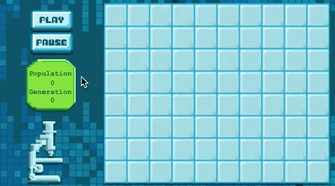

In this tutorial you are going to further familiarize yourself with Swift and SpriteKit by making a mobile version of Conway's Game of Life. If you've never heard of Conway's Game of Life, [Wikipedia](http://en.wikipedia.org/wiki/Conway%27s_Game_of_Life) has a great article. Nearly every programmer has written a version of this game at some point in their careers and wasted lots of time staring at cool shapes morphing. Consider this your initiation.

Search for 'conway's game of life' on Google for a little easter egg :]

##TL;DR

There is a grid of cells. A cell is either alive or dead and follow these rules:

- If a cell has less than two live neighbors, it dies
- If it has more than three neighbors, it dies
- If a live cell has exactly two or three neighbors, it stays alive
- If a dead cell has exactly three neighbors, it comes to life

You can check out an in-browser version of the [Game of Life](https://jsfiddle.net/makeschool_dion/zose7rv3/embedded/result/)

Try placing a few live cells and then hitting the next button to run one round. The Wikipedia article has some great examples of common patterns that produce cool effects. Press the animate button to continuously run the game. Play around with it a little and come back when you're ready to begin.

#What you will learn

In this tutorial, you will learn how to:

- Subclass *SKSpriteNode* and build a self contained simulation node
- Programmatically generate a grid of sprites
- Handle touch input
- Manipulate a 2D array
- Build a scheduler
- Translate the Game of Life ruleset into code

#The finished product

Time to get started with a new SpriteKit project!

#Feedback

If you have feedback on this tutorial or find any mistakes, please open issues on the [GitHub Repository](https://github.com/MakeSchool-Tutorials/Game-of-Life-SpriteKit-Swift).
