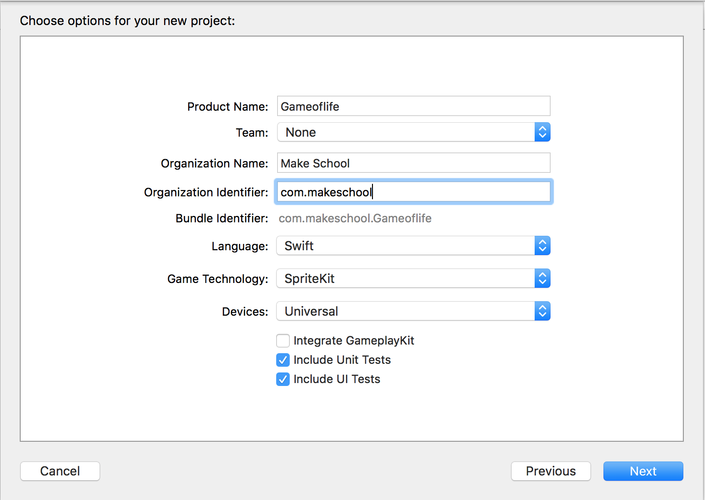
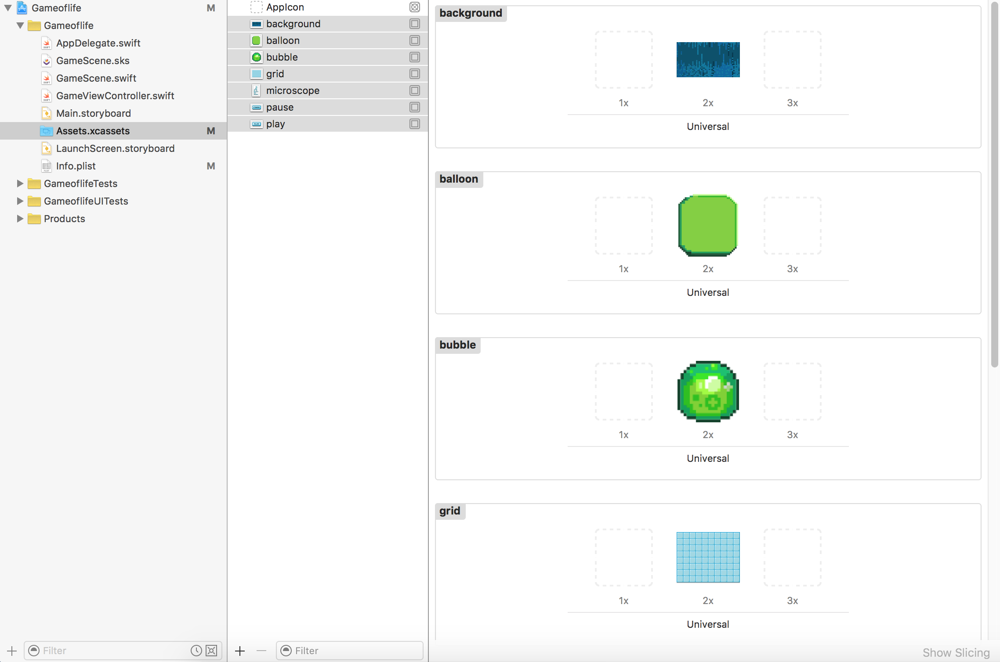
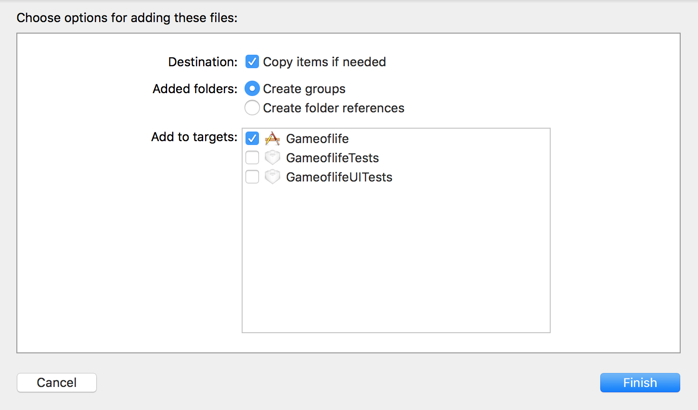
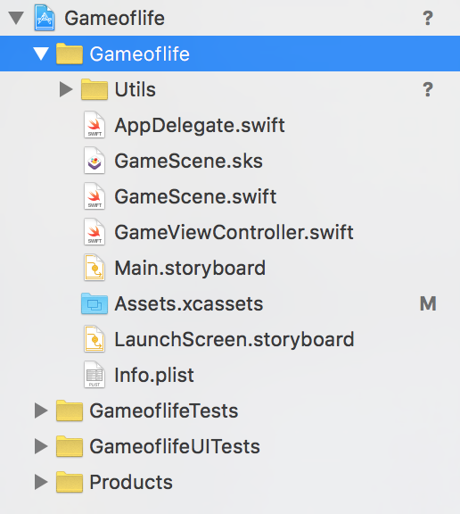
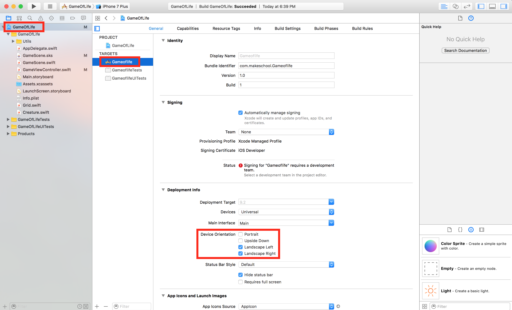

#Create a new SpriteKit project

> [action]
> Create a new *Game* project in Xcode named `Gameoflife` and check the *Language* is set to `Swift` and *Game Technology* is set to `SpriteKit`.
>
> 

##Importing Resources

> [action]
> Download the [Game of Life Art Pack](https://github.com/MakeSchool-Tutorials/Game-Of-Life-SpriteKit-Swift/raw/master/assets.zip) we created for you.
> Once the download is complete, unpack the folder.
> Click on the *Assets.xcassets* folder and drag across the assets.
>
> 

These assets were designed with the iPhone 5 retina resolution.

##Adding extra functionality

SpriteKit is missing some useful functionality, thankfully we've bundled some together for you.  

> [action]
> Download the [MakeSchool Utilities](https://github.com/MakeSchool-Tutorials/Game-Of-Life-SpriteKit-Swift/raw/master/Utils.zip), unpack and drag the folder into the project.
> Ensure *Copy items if needed* is checked.
>
> 

Your project structure should hopefully look similar to this:



#Device orientation

The game assets were designed for landscape orientation, so you should ensure that the game will not accidentally use portrait.

> [action]
> Open the target settings settings.
>
> Uncheck any **Portrait** options and check the **Landscape** options.
>
> 
>

#Clean project

To ensure a clean starting point, ensure your *GameScene.swift* reads as follows:

```
import SpriteKit

class GameScene: SKScene {

    override func didMoveToView(to view: SKView) {
        /* Setup your scene here */
    }

    override func touchesBegan(_ touches: Set<UITouch>, withEvent event: UIEvent?) {
       /* Called when a touch begins */
    }

    override func update(_ currentTime: CFTimeInterval) {
        /* Called before each frame is rendered */
    }
}
```

#Summary

Great, now you have a new project ready to begin building the Game of Life.  In the next chapter you will focus on creating the user interface.
