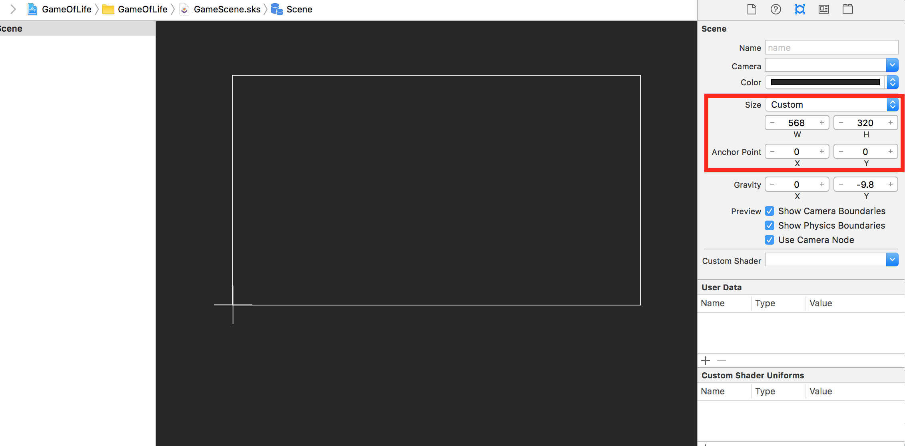

The "game" is a zero-player game, meaning that its evolution is determined by its initial state, requiring no further input. One interacts with the Game of Life by touching the grid to setup the initial configuration. Unlike the previous tutorials there are no in-game controls as such. Let's build the scene.

#Setting the scene

The game assets were designed with the iPhone 5 retina resolution in mind, let's modify the scene size to work with this design resolution.

> [action]
> Open *GameScene.sks*, *Zoom Out* the scene, set the *Size* to `(568,320)`, set the *Anchor Point* to `(0,0)`, click on the "Hello, World!" label, and remove it by pressing the `delete` key.
>
> 

##Adding the background

> [action]
> Drag *background.png* onto the scene and snap to the center of the *GameScene*.
> Set *Z-Position* to `-1` to ensure the background is always at the back.

#Adding the grid

> [action]
> Drag *grid.png* onto the scene, set *Anchor Point* to `(0,0)` bottom-left.
> Set *Position* to `(175,6)` and set *Name* to `gridNode`

The core simulation will happen inside the grid and you will be creating your own *SKSpriteNode* subclass to handle this later on.

> [action]
> Set the *Custom Class* to `Grid`
> 

#User Interface buttons

##Adding the play button

> [action]
> Drag *play.png* onto the scene and set *Position* to `(88,283)`
> Set *Name* to `playButton` and set *Custom Class* to `MSButtonNode`

##Adding the pause button

> [action]
> Drag *pause.png* onto the scene and set *Position* to `(88,241)`
> Set *Name* to `pauseButton` and set *Custom Class* to `MSButtonNode`

##Adding the step button

This button will serve as a handy way to test the game, allowing you to step through the simulation one iteration at a time.  We're going to use the microscope asset, consider it an easter egg for the player.

> [action]
> Drag *microscope.png* onto the scene and set *Position* to `(81,60)`
> Set *Name* to `stepButton` and set *Custom Class* to `MSButtonNode`

#Simulation information

Typically in Conway's game of life you want to display the population and generation of the creatures.  The generation refers to the number of times the simulation has ran so far.

##Adding the backdrop

> [action]
> Drag *balloon.png* onto the scene and set *Position* to `(87,172)`

##Population label

> [action]
> Drag a *Label* onto the scene and set *Position* to `(87,189)`
> Set *Z-Position* to `1` as you want to ensure the label sits on top of the backdrop
> Set *Text* to `Population`

The default label doesn't look right, you want to select a font that fits in with the overall aesthetic.

> [action]
> Click on *Font* to bring up the font selection dialog. **I went with `Courier New Bold 12`, feel free to
use whatever you think looks good.**
> Click on *Color*, **I used the color picker to pick out the dark green, *RGB* `21,93,53`**

> 

##Generation label

You have the population label, now add the `Generation` label.  

> [action]
> Add a `Generation` label, Set the *Position* to `(87,158)`

##Dynamic label counters

Next you will need two labels to display the values for population and generation respectively.

###Population

> [action]
> *Copy/Paste* the `Population` label, set *Position* to `(90,173)` and set *Text* to `0`.
> You will need a code connection for this population counter, set *Name* to `populationLabel`

###Generation

> [action]
> See if you can repeat this process and add a `generationLabel` at `(90,144)`

Your finished UI should hopefully look like this:

#Summary

You've set the stage for the game and built the user interface, in the next chapter you will work on the *Grid* custom class which will perform the heavy lifting in this simulation.
