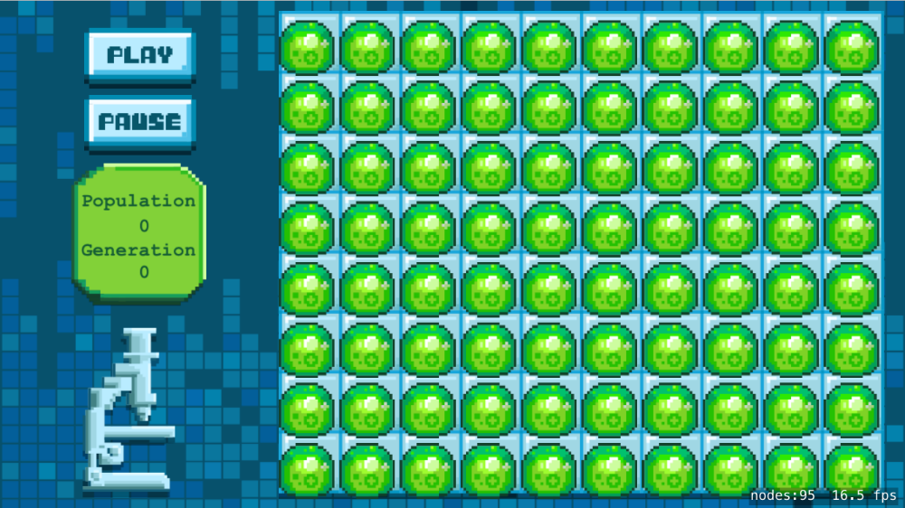

Time to code! In this step you are going to hook up the UI we've created in SpriteBuilder with the game logic you're 
going to code in Xcode.

#Create the grid class

The grid class will be a subclass of *SKSpriteNode*.

> [action]
> Create a new *Swift* file (`File > New > File > Swift File`) and name it `Grid.swift`.
> Replace the contents of this file with:
>
```
import SpriteKit

class Grid: SKSpriteNode {
>    
    /* Grid array dimensions */
    let rows = 8
    let columns = 10
>    
    /* Individual cell dimension, calculated in setup*/
    var cellWidth = 0
    var cellHeight = 0
>    
    override func touchesBegan(_ touches: Set<UITouch>, with event: UIEvent?) {
        /* Called when a touch begins */
>        
        /* There will only be one touch as multi touch is not enabled by default */
        let touch = touches.first!
        let location = touch.location(in: self)
    }
>    
    /* You are required to implement this for your subclass to work */
    required init?(coder aDecoder: NSCoder) {
        super.init(coder: aDecoder)
>        
            /* Enable own touch implementation for this node */
            isUserInteractionEnabled = true
>
            /* Calculate individual cell dimensions */
            cellWidth = Int(size.width) / columns
        cellHeight = Int(size.height) / rows
>        
    }
}
```
>

The above code should be familiar by now, if you look at the grid asset in *GameScene.sks* you will see it has `8` 
rows and `10` columns.  During the initialization of the *Grid* object, the *cellWidth* & *cellHeight* properties 
will be calculated as these will also be required later on.

What will sit in the boxes on the grid? That would be the *bubble.png* asset, before you can populate the grid with 
these slimy bubbles you will be adding a custom creature class.

## Create the creature class

The *Creature* class will be another subclass of *SKSpriteNode*

> [action]
> Create a new *Swift* file (`File > New > File > Swift File`) and name it `Creature.swift`.
> Replace the contents of this file with:
>
```
import SpriteKit
>
class Creature: SKSpriteNode {
>    
    /* Character side */
    var isAlive: Bool = false {
        didSet {
            /* Visibility */
            isHidden = !isAlive
        }
    }
>    
    /* Living neighbor counter */
    var neighborCount = 0
>    
    init() {
        /* Initialize with 'bubble' asset */
        let texture = SKTexture(imageNamed: "bubble")
        super.init(texture: texture, color: UIColor.clear, size: texture.size())
>
        /* Set Z-Position, ensure it's on top of grid */
        zPosition = 1
>        
        /* Set anchor point to bottom-left */
        anchorPoint = CGPoint(x: 0, y: 0)
    }
>    
    /* You are required to implement this for your subclass to work */
    required init?(coder aDecoder: NSCoder) {
        super.init(coder: aDecoder)
    }
}
```

The code above should be mostly familiar to you.  All instances of the *Creature* class will be created in code, 
you are setting the `init()` to use the *bubble.png* asset and then calling the parent *SKSpriteNode* with 
*super.init* to initialize everything as normal for a *SKSpriteNode*.

There are two important property additions in your *Creature* class:

- **isAlive**: Is the creature alive or dead? If dead you want to hide it using the *hidden* property.
- **neighborCount**: How many creatures immediately (one block) surround the creature?

# Populating the grid

It would be great to run the game soon, let's populate the grid with creatures. You also need a way to track all of 
the creatures on the grid.

## The 2D grid array

A 2D array of creatures would be a great way to create a code representation of the grid.

> [action]
> Add the following 2D array property to the *Grid* class:
>
```
/* Creature Array */
var gridArray = [[Creature]]()
```

The next step required is to initialize the *gridArray*, you already know the *row* and *column* sizes. A simple 
`for loop` through all the *rows/columns* in the *gridArray* will allow you to do this.

## Adding a creature

The `addCreatureAtGrid(...)` method, this should perform the following tasks:

- Initialize a new *Creature* object
- Convert the row/column position into a grid screen position
- Add creature as a child of the grid node
- Add creature to the gridArray at the x,y position

> [action]
> Can you implement this method?
> I'll give you a tip, remember the *cellWidth* and *cellHeight* properties ? :]

<!-- -->

> [solution]
>
```
func addCreatureAtGrid(x: Int, y: Int) {
    /* Add a new creature at grid position*/
>
    /* New creature object */
    let creature = Creature()
>
    /* Calculate position on screen */
    let gridPosition = CGPoint(x: x*cellWidth, y: y*cellWidth)
    creature.position = gridPosition
>
    /* Set default isAlive */
    creature.isAlive = true
>
    /* Add creature to grid node */
    addChild(creature)
>
    /* Add creature to grid array */
    gridArray[x].append(creature)
}
```

## Initialize the array

> [action]
> Add the following method to the *Grid* class:
>
```
func populateGrid() {
  /* Populate the grid with creatures */
>  
  /* Loop through columns */
  for gridX in 0..<columns {
>      
      /* Initialize empty column */
      gridArray.append([])
>      
      /* Loop through rows */
      for gridY in 0..<rows {
>
          /* Create a new creature at row / column position */
          addCreatureAtGrid(x:gridX, y:gridY)
      }
  }
}
```
>

Read through the comments, you loop through every entry in the grid and call the `addCreatureAtGrid(...)` method. 
Now you just need to create this new method :]

Great, one last step.  You need to call `populateGrid()` to perform this setup.

> [action]
> Add the following to the *end* of `required init?(...)`:
>
```
/* Populate grid with creatures */
populateGrid()
```
>

Finally, it's time. Run your game... It should hopefully look like this.



# Touch controls

The grid is full of creatures! It would be nice to have control over the initial seed state so let's look at 
adding touch controls to the grid.

You should change the creatures to be dead by default and the player's touch will make the creature at that grid 
position come to life.

> [action]
> Change `creature.isAlive = true` to `creature.isAlive = false`

You want to implement the following behavior in `touchesBegan(...)`:

- Convert grid touch to grid row/column position
- Access creature at this position in the array
- Toggle the `isAlive` property

> [action]
> Can you implement this?

<!-- -->

> [solution]
> Add the following to `touchesBegan(...)` after `let location`:
>
```
/* Calculate grid array position */
let gridX = Int(location.x) / cellWidth
let gridY = Int(location.y) / cellHeight
>
/* Toggle creature visibility */
let creature = gridArray[gridX][gridY]
creature.isAlive = !creature.isAlive
```
>

Run your game... You should be able to design your own seed pattern now.

# Counters

Before you begin working the simulation, let's add some counters for *population* and *generation*.

> [action]
> Can you add these counters to the *Grid* class?

<!-- -->

> [solution]
> Add the following properties to the *Grid* class.
>
```
/* Counters */
var generation = 0
var population = 0
```

# The simulation

There are two important steps to implement in the Game of Life simulation.

1. Calculate every creature's immediate living neighbors
2. Apply the game of life ruleset
    - If a cell has less than two live neighbors, it dies
    - If it has more than three neighbors, it dies
    - If a live cell has exactly two or three neighbors, it stays alive
    - If a dead cell has exactly three neighbors, it comes to life

## Calculating neighbors

For every creature in the grid, you'll need to count every surrounding creature.  Imagine a 3x3 grid with your 
creature at the center. How would you approach this?

You will want to check both rows and columns that are +1/-1 from your central creature. There are a few caveats of 
course, you need to be careful near the extremes of the grid as stepping outside the bounds of the array will result 
in a crash. Also the central creature should not be counted.

> [action]
> See if you can setup the first step in the `countNeighbors()` method.
> You want to loop through every creature in the grid and reset its *neighborCount* property to `0`

<!-- -->

> [solution]
> Add the following method to the *Grid* class:
>
```
func countNeighbors() {
/* Process array and update creature neighbor count */
>
  /* Loop through columns */
  for gridX in 0..<columns {
>
    /* Loop through rows */
    for gridY in 0..<rows {
>      
      /* Grab creature at grid position */
      let currentCreature = gridArray[gridX][gridY]
>
      /* Reset neighbor count */
      currentCreature.neighborCount = 0
>
      /* Loop through all adjacent creatures to current creature */
      for innerGridX in (gridX - 1)...(gridX + 1) {
>
        /* Ensure inner grid column is inside array */
        if innerGridX<0 || innerGridX >= columns { continue }
>
        for innerGridY in (gridY - 1)...(gridY + 1) {
>
            /* Ensure inner grid row is inside array */
            if innerGridY<0 || innerGridY >= rows { continue }
>  
            /* Creature can't count itself as a neighbor */
            if innerGridX == gridX && innerGridY == gridY { continue }
>      
            /* Grab adjacent creature reference */
            let adjacentCreature:Creature = gridArray[innerGridX][innerGridY]
>          
            /* Only interested in living creatures */
            if adjacentCreature.isAlive {
                currentCreature.neighborCount += 1
            }  
        }
      }    
    }
  }
}
```
>

Please read through the code comments.

## Applying the ruleset

Now that you can calculate every creatures *neighborCount*, you now need to apply the rule set above to simulate the 
Game of Life. Again you need to loop through every creature in the grid and apply the ruleset.

> [action]
> See if you can implement an `updateCreatures()` method.

<!-- -->

> [solution]
>
```
func updateCreatures() {
  /* Process array and update creature status */
>
  /* Reset population counter */
  population = 0
>
  /* Loop through columns */
  for gridX in 0..<columns {
>
      /* Loop through rows */
      for gridY in 0..<rows {
>          
          /* Grab creature at grid position */
          let currentCreature = gridArray[gridX][gridY]
>
          /* Check against game of life rules */
          switch currentCreature.neighborCount {
          case 3:
              currentCreature.isAlive = true
              break;
          case 0...1, 4...8:
              currentCreature.isAlive = false
              break;
          default:
              break;
          }
>
          /* Refresh population count */
          if currentCreature.isAlive { population += 1 }
      }
  }
}
```

Read through the comments, there shouldn't be any surprises in here.

You could just as easily use an `if` statement when it comes to checking the `neighborCount`.  The *Switch statement* 
is very powerful in Swift and allows for a lot of flexibility.

You may have noticed the *population* counter is being updated, you will be using this value to update the population 
label in the *GameScene*.

# Summary

Congratulations, you've implemented the game logic for Conway's Game of Life!
You've also levelled up your array handling skillz.

In the next chapter you're going to put the final pieces together to run and observe the simulation.
