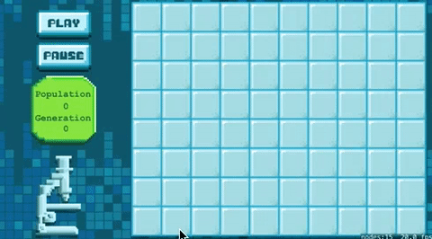
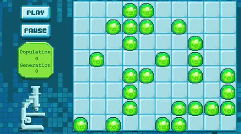

You've implemented the core game logic for Conway's Game of Life.  However, the game doesn't run yet...
The next step is being able to run each iteration of the simulation, you're going to setup a *step* method and add a handy debug button to manually step the simulation to validate the simulation produces the expected results.

Once you know your simulation is valid, you will build your own scheduler to iterate the simulation every `0.5` seconds.

#Step by step

Let's add an `evolve()` method to the *Grid* class, this will wrap up the `countNeighbors()` and `updateCreatures()` methods. You also want to track the current `generation` of the simulation.

> [action]
> Add the following method to the *Grid* class:
>
```
func evolve() {
   /* Updated the grid to the next state in the game of life */
>
   /* Update all creature neighbor counts */
   countNeighbors()
>
   /* Calculate all creatures alive or dead */
   updateCreatures()
>
   /* Increment generation counter */
   generation += 1
}
```
>

That's the *Grid* class complete!

#Connecting the UI

It's time to code connect the UI you built in chapter 2, this process should be familiar to you by now.

> [action]
> See how far you can get code connecting all of the buttons and counter labels in the *GameScene.sks* to *GameScene.swift*

<!-- -->

> [solution]
> Add the following properties to the *GameScene* class:
>
```
/* UI Objects */
var stepButton: MSButtonNode!
var populationLabel: SKLabelNode!
var generationLabel: SKLabelNode!
var playButton: MSButtonNode!
var pauseButton: MSButtonNode!
```
>
> Then add your connections in `didMoveToView(...)`:
>
```
/* Connect UI scene objects */
stepButton = childNodeWithName("stepButton") as! MSButtonNode
populationLabel = childNodeWithName("populationLabel") as! SKLabelNode
generationLabel = childNodeWithName("generationLabel") as! SKLabelNode
playButton = childNodeWithName("playButton") as! MSButtonNode
pauseButton = childNodeWithName("pauseButton") as! MSButtonNode
```
>

#Connecting the Grid

To access the `evolve()` method and counter properties of the *Grid* class you will need to create a code connection for it.

> [action]
> Add a code connection for the *gridNode*.

<!-- -->

> [solution]
> Add the following property to the *GameScene* class:
>
```
/* Game objects */
var gridNode: Grid!
```
>
> Then add your connections in `didMoveToView(...)`:
>
```
gridNode = childNodeWithName("gridNode") as! Grid
```
>

#The step button

It would be great to test the simulation step before it becomes scheduled.  You're going to add a `stepSimulation` method
to call the *Grid* class `evolve()` method and update the UI counter labels in the *GameScene* using the *Grid* counters.

> [action]
> Add the following method to the *GameScene* class:
>
```
func stepSimulation() {
  /* Step Simulation */
>
  /* Run next step in simulation */
  gridNode.evolve()
>  
  /* Update UI label objects */
  populationLabel.text = String(gridNode.population)
  generationLabel.text = String(gridNode.generation)  
}
```
>

Time to use your secret testing button, the microscope or *stepButton* as it's been named.
You need to add a *selectedHandler* for the button, this should simply call the new `stepSimulation()` method.

> [action]
> Add a handler for *stepButton* that calls `stepSimulation()`

<!-- -->

> [solution]
> Add the following to `didMoveToView(...)`:
>
```
/* Setup testing button selected handler */
stepButton.selectedHandler = {
    self.stepSimulation()
}
```
>

Run your game... You should be able to add some creatures and step the simulation, keep an eye on the population and generation counters.

#Testing the simulation

How do you know if the simulation is accurate?

Thankfully the Game of Life is well documented and there are common patterns you can test with.
The Blinker is an easy way to test with, three creatures in a row that will switch between horizontal and vertical.


Run your game again and try this pattern...



Great job!

#Adding a scheduler

The simulation works and now you want to let it run, it's not much fun spamming the step button.  What you need is a way to schedule the `stepSimulation()` method to run say every `0.5` seconds.

You could use the standard *NSTimer*.  However, this timer would be outside of the SpriteKit*render cycle and could cause problems, you need a scheduler that sits within the SpriteKit render cycle.  

You can build a simple scheduler using *SKActions*, let's look at how to implement this.

> [action]
> Add the following code to `didMoveToView(...)`
>
```
/* Create an SKAction based timer, 0.5 second delay */
let delay = SKAction.waitForDuration(0.5)
>
/* Call the stepSimulation() method to advance the simulation */
let callMethod = SKAction.performSelector(#selector(GameScene.stepSimulation), onTarget: self)
>
/* Create the delay,step cycle */
let stepSequence = SKAction.sequence([delay,callMethod])
>
/* Create an infinite simulation loop */
let simulation = SKAction.repeatActionForever(stepSequence)
>
/* Run simulation action */
self.runAction(simulation)
>
/* Default simulation to pause state */
self.paused = true
```
>

##Play/Pause

Your scheduler is ready to go, you just need to add the final button handlers.

> [action]
> See if you can setup both the *playButton* `selectedHandlerselected` and the *pauseButton* `selectedHandler`
> **Tip**: What is the current simulation pause state ?

<!-- -->

> [solution]
> Add the following to the end of the `didMoveToView(...)` method:
>
```
/* Setup play button selected handler */
playButton.selectedHandler = {
    self.paused = false
}
>
/* Setup pause button selected handler */
pauseButton.selectedHandler = {
    self.paused = true
}
```
>

Run your game...



Congratulations you've completed *Game of Life*, give the person next to you a high five.

You learnt to:
- Control your simulation
- Build a simulation scheduler using *SKActions*

The next chapter will be a recap of everything you have covered so far, well done.
