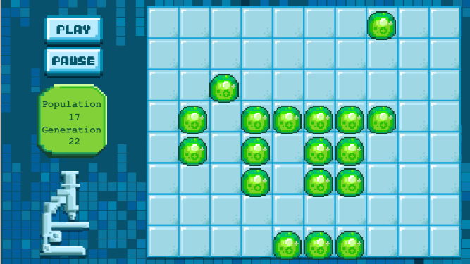

Congrats again on finishing *Game of Life* and building another great iPhone game!

Let's take a look at what you have learned.

##What you learned

- **The Grid Class**: Sub classing *SKSpriteNode* and built a self contained simulation node.

- **Creature generator**: Adding methods to spawn creatures at a give grid position and automate this to produce creatures at every entry in the grid.

- **Touch input**: Translating user touch into grid row / column position.

- **2D arrays**: Creation and manipulation of 2D array. Implementing functionality to traverse all neighbors of a specified cell to calculate `neighborCount`

- **Build a scheduler**: Using *SKActions* to build a simulation scheduler allowing you to automate the running of the simulation.

- **Game of Life ruleset**: Translating the Game of Life ruleset into code logic.

#Solution

[Download Game of Life](https://github.com/MakeSchool-Tutorials/Game-Of-Life-SpriteKit-Swift-Solution).

